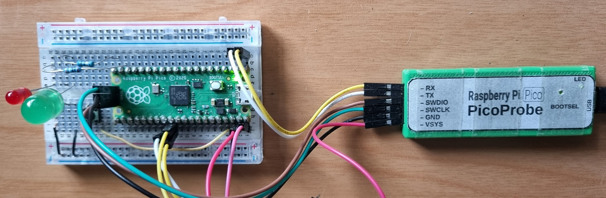

# Raspberry Pico RP2040 Concurrent Multi LED Blinker

Simple example of using embassy embedded rust framework to blink 3 LEDs concurrently.

* Pin 25 - Builtin LED
* Pin 14 and Pin 15

This is an out-of-tree crate project, using https://github.com/embassy-rs 20-Apr-2023 [patch.crate-io] commit.

## Setup & Run

```
rustup default nightly
rustup update
rustup target add thumbv6m-none-eabi

cargo install probe-rs-cli
```


### Run

```
cargo run 
or
cargo run --release
```